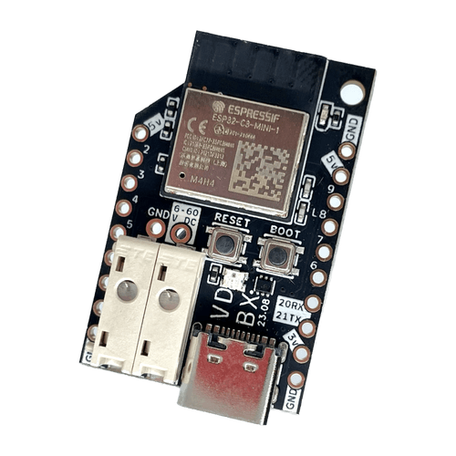
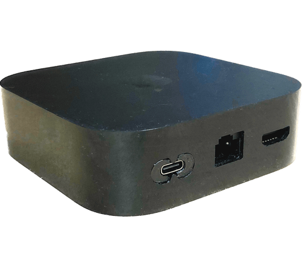
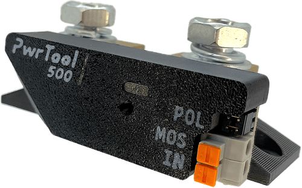

# Welcome

> This is the official Voidbox Industries documentation site that will soon serve as our main website since we've moved all sales to Amazon. This will allow us to focus more on the Crowd Supply campaign for the PwrTool 500.
>
> _Chloe Madison - Nov 2024_

## Current Products

<table data-header-hidden data-full-width="false"><thead><tr><th>Pic</th><th>Name</th><th>Description</th><th>Links</th></tr></thead><tbody><tr><td></td><td><h3>FLIP_C3</h3></td><td>Our ESP32 dev board with a 60v max in buck converter for use on 12-48v batteries. Designed for ESPHome and Home Assistant.</td><td><a href="https://amzn.to/40i4fuK">Buy on Amazon </a>/ <a href="product/flip_c3/">Documentation</a></td></tr><tr><td></td><td><h3>USB-C for AppleTV</h3></td><td>A full modkit including tools to cleanly replace the AC PSU in an AppleTV 4k (2022) with a 5v USB-C port.</td><td><a href="https://amzn.to/3rvqmkk">Buy on Amazon</a> / <a href="product/usb-c-mod-for-apple-tv-2022.md">Documentation</a></td></tr><tr><td></td><td><h3>PwrTool 500</h3></td><td>A 500 amp DC battery monitor / smart shunt for Home Assistant. Based on FLIP_C3 using ESPHome. </td><td><a href="https://www.crowdsupply.com/voidbox-industries/pwrtool-500">Launching soon on Crowd Supply</a></td></tr></tbody></table>

## About

VDBX or "Voidbox Industries" is currently focused on designing hardware for use with Home Assistant in off-grid, battery powered setups. Our hardware lineup for 2023 is focused on the FLIP-C3 node platform for creating smart devices on off-grid and battery powered systems. The project takes a priority with integrating into Home Assistant via the ESPHome firmware, but can run anything an ESP32-C3 can.&#x20;

Chloe Madison, resident designer and founder currently lives full time in a converted "shorty" school bus that she's constantly still working on.

## Support

We make a lot of things that we sell, we also make a lot that is solely to be shared online freely... in either case, we provide all source files so you can hack or make these things yourself. The best way to support our work is to buy our products via our stores on Amazon, ~~Tindie, and our website~~. You may also buy parts and products via our affiliate links.

&#x20;If you'd like to show additional or alternate support, you can support any of our makers directly:

* Chloe Madison - @clomads - [Patreon](https://www.patreon.com/clomads)&#x20;
* More soon (hopefully)

## Message from Chloe

Voidbox Industries is yet another one of my brands making sure I don't have to do a bland 9-5 and instead can rely on my art. It's not always worth it, but making art is a compulsion for me and I can't imagine doing anything else (aside from the dopamine rabbit holes). Also I'm autistic.... have fun with that.&#x20;

In 2017, while becoming disillusioned with the tech industry, I decided to dive deeper into a maker hobby most people would have already assumed I had years of experience with. Starting with mold making, concrete pouring and mentally mapping basic material science; all while learning to 3D model and design circuits. I've always been a designer first ... just with a serious interest in doing so with technology. Going down this road opened my eyes to what I was capable of as an artist.

When COVID hit, I was focused on making concrete [knicknacks](concrete/concrete-card-holder.md) and my sales immediately dried up, but a few months later, my unemployment finally went thru and I decided to make some changes. At the time I was living in a van and had a small private art studio in Berkeley amongst a shared artist warehouse. I realized this wasn't tenable long-term and I wanted to consolidate even more so that I wouldn't run into a situation where not being able to pay rent would turn to dire circumstances.&#x20;

I found my bus in July 2020 and immediately started building and also moved in while it was still very much a prototype. Over the next few years, I worked on building it closer and closer to my vision, while I prepped to get back to work as the world decided that COVID doesn't exist anymore. I spent a significant amount of this time dealing with physical and mental health issues, but thankfully do have access to medical care. Unfortunately this means I have to put my concrete work on hold until I have space to make that kind of mess again.

I knew this was necessary when I moved everything into the bus, so I'm not upset by it despite missing it. In 2023 I started refining some of my findings from building my bus and integrating Home Assistant into an off-grid application and released the FLIP\_C3 and the end of that year. In June of 2024 I got the PwrTool 500 pre-launched on Crowd Supply with the official lauch coming around Jan 2025.

I'm starting to become seen by my peers which feels really amazing.&#x20;

I hope to someday have the opportunity to turn Voidbox into a worker co-op that manufactures & retails open hardware for other makers and artists, especially under-represented folks.  It may just be me right now, but I use "we" optimistically throughout these docs.

_@clomads - Chloe Madison_

## Affiliate Marketing

We are currently a part of the affiliate programs for Amazon and AliExpress with the potential for others. Any links to those platforms are likely to contain our affiliate code which tells them that we sent you. Your price doesn't change, but we may get a small kickback from your order for sending you over.
