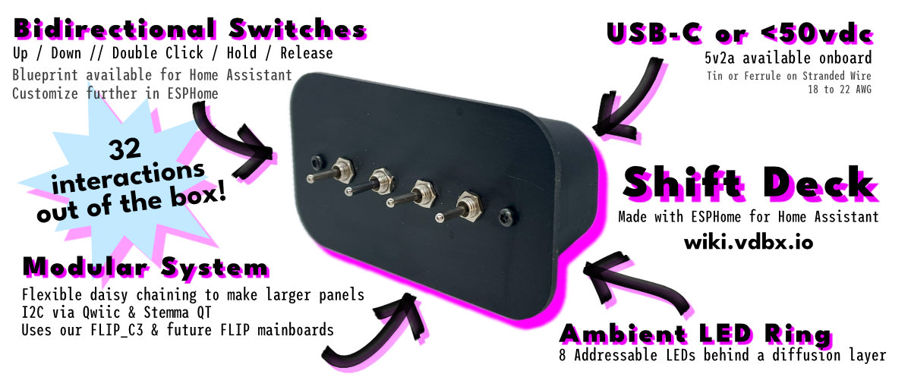

# Shift Deck

<figure><figcaption>
December 2023 design &#x26; functionality prototype and current features.
</figcaption></figure>

## Latest:

23.12.14 - Considering design changes to enclosure. Need documentation for PCB only kits.

**231112** - Working prototype PCB in testing with nearly feature full MVP ESPHome build and blueprint to integrate into Home Assistant

## Summary

A set of four (4) dual-throw momentary toggle switches in a modular wall enclosure and faceplate system. It is designed to work directly with our FLIP platform running ESPHome.  It is connected via an I2C interface allowing it also to be daisy chained to itself to create larger switch panels.&#x20;

**SPDT (Single Pole Dual Throw)** - A dual throw switch has two distinct motions from its center. In a momentary version, it can toggle outward in two directions, for example up/down or left/right based on the physical orientation of the switch. The most common of these is a window switch in a car. Single pole refers to the fact that there is only one bank of connections being switched. While single pole switches may be optimal, dual or triple pole may be necessary due to availability.

## How to install

1. Power up: Use a USB-C cable or feed up to 60VDC to the spring terminals
2. Connect to the `Unnamed Switch Panel XXXXX` Wifi and enter your Wifi credentials when the prompt comes up.&#x20;
3. Check Home Assistant for a new device notification or check the integrations page for the switch panel
4. Press configure and follow the steps
5. Download this Blueprint and configure

[Help Me -→](installation.md)

## User Experience

Dual-throw momentary toggle switches allow for a direct UX comparison to legacy house switches when moving to smart automation systems. Keeping the muscle memory of Up = On and Down = Off is important to a lot of us when much of the IOT landscape is trying to get us to learn new UX patterns.&#x20;

Spacing between switches was previously a concern, but no longer seems to be an issue. The first prototype has so far proven that spacing is more than adequate.&#x20;

## Design & Manufacturing

The required depth of the components created a unique opportunity to be bold in our design choices. The spacious cover plate is larger and almost floats on top of the housing which is recessed behind it. In a vacuum, its shape evokes a mid-century modern design aesthetic, though color and material choices could adapt it to any decor.

The cover-plate design is easily manufacturable via 2D machining methods (laser, basic cnc)

The housing is 3D printable with the possibility of injection molding with the right modifications. It could theoretically be bent sheet metal.

## Placement

Originally intended to be mounted to a wall, it seems it may also work well on a desk as it stands up with little issue and could have power coming out the back. This changes some of the design work, but shouldn't be too big a deal.

It was specifically designed so it could live anywhere but in a standard wall box. Blanking plates will eventually be available optionally with and without AC transformers for this possible use, but we encourage an open mind when considering placement. Get one of those outlets with USB ports and put the switch panel next to it with a[ slim USB cable.](./#resources)&#x20;

~~The rear of the housing is mostly open, but there are two areas that can be used for VHB or nano-style double-sided tape. Next to each one of those areas is a hole for screw mounting.~~

Back should be closed, but interior markings could show where to make holes for certain things like mounting screws or alternate cable passthrus - should have a default cable passthru for USB-C.&#x20;

When screw mounting, remove the cover-plate screws and mount the housing first, then re-attach the cover-plate and screws.

## Technical

* Based on PCF8574 IO Expander
  * 8 Pins for switch 1-4 up/down
  * Up to 8 panels on same I2C bus via 3P DIP switch
* Qwiic & Stemma QT compatible 4 pin headers for expansion
* PT/Flip Module accepts USB-C or up to 60V DC
  * Great for RVs or off-grid!
* Designed to be as compact as possible for custom designs

## Resources

[https://s.click.aliexpress.com/e/\_DefEShP](https://s.click.aliexpress.com/e/\_DefEShP) - Thin USB-A to C cables for placing next to an outlet with USB ports

[https://s.click.aliexpress.com/e/\_DDbsYx7](https://s.click.aliexpress.com/e/\_DDbsYx7) - Thin C to C cable

_<mark style="color:orange;">Affiliate links don't change your price, but give us a small percentage of sales.</mark>_
