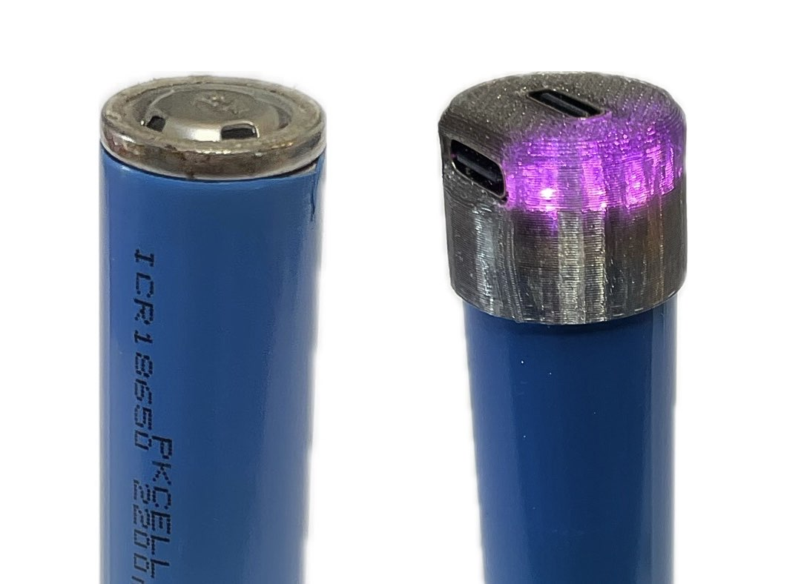

# PwrTop 18

&#x20;<mark style="background-color:orange;">TODO: Photos, Diagrams, Files</mark>

PwrTop 18 takes inspiration from existing "lipstick" style battery banks, but removes significant bulk by uniquely taking both positive and negative from a single side of the cell. In its most basic configuration, it only adds about 7mm of length to a standard 18650 cell.


For flat-top 18650 cells of Lithium Ion chemistry only - Charges to 4.2v at up to 3A / 2A selectable via solder jumper



This device requires modification, removal, and/or replacement of the heat shrink wrap on your 18650 cells. Do not allow unwrapped cells to come in contact with other metals as to cause a short, especially the positive end which is surrounded by the case's ground connection.&#x20;

Use at your own risk. Don't put uncovered 18650s in your pocket.&#x20;


## Configurations

There are currently two ways to attach the PwrTop 18 circuit board to an 18650 cell. We welcome you to [submit your own ideas](https://github.com/vdbxio/wiki/issues) to make this project as widely useful as possible.

### 3D Printed Cap

<figure><figcaption>
Two 18650s: One shows its wrap circumcised, the other has a PwrTop with 3D Printed Cap
</figcaption></figure>

The 3D printed cap adds a bit of thickness, but is the easiest way to get going and allows you to quickly switch out cells. The only modification needed is to circumcise your cell's wrap near the positive end. Use the crimped groove on this side to cleanly cut the wrap as if it's foil on a bottle of wine. Remove this little bit of plastic and any circular insulators it held in place.

Assembly of the PwrTop 18 circuit board into the 3D print is a bit fiddly, but once placed, you can simply friction fit the assembly on your cell. A clockwise twisting motion may help properly seat it on tighter fitting cells. I don't want to condone a quick smack on the top, but it does work.&#x20;

[**3D Models >**](pwrtop-18.md#id-3d-models)

### Re-wrap Method

This produces the most streamlined assembly and is great for long-term use in this configuration. You will need an 18650 heat-shrink wrap in a color of your choice and a US dime, or something of similar thickness that is less than 18mm in-diameter. Optionally insulate the base with an 18mm sticker.&#x20;

Current Process: (Working)

1. Remove wrap and insulator from entire cell
2. Place new wrap around cell
3. Place dime or other spacer \~1-2mm on table - for clean bottom edge
   1. Place cell and wrap on dime/spacer with Positive facing up.
   2. Make sure wrap is touching table over dime
4. Place PwrTop PCB with terminals down on cell, inside wrap.
   1. Hold down firmly with finger at USB port - LEDs should do a startup sequence
5. Using a lighter or a heat gun, start shrinking process at the top. If you need to turn to make it around, make sure to keep pressure on the top USB port.&#x20;
   1. Don't burn yourself
   2. The side USB C port will be partially if not mostly covered, do not worry
6. Once top section is secure, you may continue shrink process on the bottom portion of cell
7. You may press a USB C connector into the side port to conform the wrap into and around the port. This will give you a good seam to cut the excess away.&#x20;
   1. Cutting too much will reduce the wrap's effectiveness to hold the assembly together. Leaving it may be a better option and will be better understood thru testing

A 3D printed cover is in the works to make this method a little cleaner, but it needs tuning.

## Eratta & Known Issues

The PwrTop 18 is being shown off at Teardown 2025 with over 200 units being given away to attendees for testing. Please note the following known quirks.

1. Does not work with Lightning (Apple) devices or any other devices that use the Fast Charge profile requiring D+ & D- to be shorted.
2. This device may get uncomfortably hot under heavy use
   1. This may weaken the re-wrap method
   2. Do not use cells if they also get unconfortably hot
3. Lower capacity and older cells may be better served by lowering the charging current
   1. Remove 0 ohm resistor jumper from the 2A/3A selector and short the opposite set of pads

## Feedback

Please submit issues and ideas as an [Issue on our wiki's Github.](https://github.com/vdbxio/wiki/issues)

## Accessories

USB-C accessories for the PwrTop 18 will focus on compactness.  Please share your ideas, 3D models, and PCB files on our [wiki's GitHub](https://github.com/vdbxio/wiki/issues). We will soon offer advice and specific parts (eg, short USB-C plugs) that will offer a starting point for your accessories.

An initial concept for a flashlight accessory was designed alongside v1 and is currently being updated based on use of this accessory.

## Future

While 18650s are the most popular and thus our first variant, we want to make more versions and would love your feedback.&#x20;

PwrTop 14 with a single port & a bit slower charging

PwrTop 21/26 - More features, ports ????&#x20;

## Specs & Docs

Designed for 18650 cells capable of up to 3A(2A Selectable) charge/discharge. 5v input/output split across 2 USB-C ports. Lithium-Ion only charges to 4.2v.

Circuit board layouts and schematics were designed in EasyEDA Pro and will be offered in the spirit of Open Source upon the official retail release.

## 3D Models


3D Printable Cap



6x 3D Printable Holder


## Changelog

v2 - Add second port and re-arrange layout - more copper pours and vias for thermal dissipation. Select better spring contact.

v1 - Original idea with single USB-C port. Tested both pogo-pins and smaller "antenna shrapnel" contacts.&#x20;
