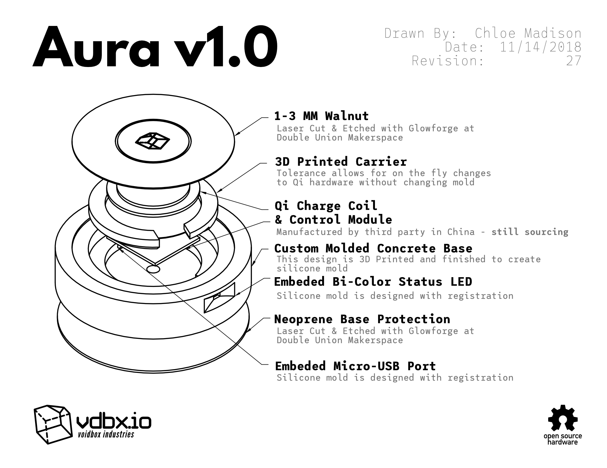

# Aura Qi

## Summary

The iPhone 8 added Qi charging and we tried to capitalize on this with a concrete and wood charging pad to fit amongst our existing product line. One working prototype was produced and significant time was put into researching large scale manufacturing and parts sourcing. Production funds were unable to be secured.

## Exploded View

<figure><figcaption></figcaption></figure>
