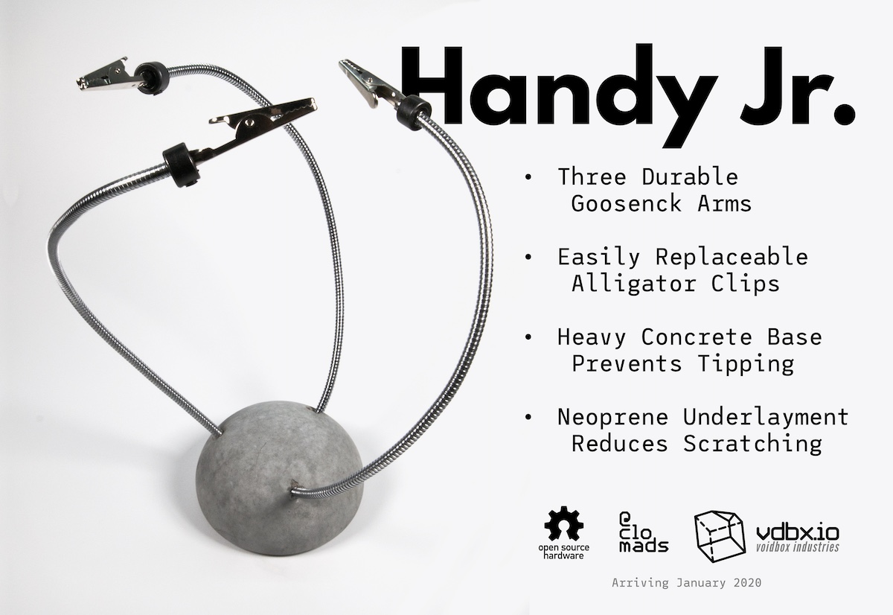

# Handy Jr.

<figure><figcaption>
A late 2019 promotional image for the Handy Jr.
</figcaption></figure>


Handy Jr. was almost production ready in 2020 and was close to launch when COVID hit. We have indefinitely shifted focus away from concrete production and no longer have access to facilities to produce these items. This could change in the future and is a want, just not a current or near future priority.


## Summary

The Handy family of products is a pair of helping hands stands made from concrete with embedded thin-bodied goosenecks.&#x20;

**Handy Jr.** is the base of the production idea, consisting of a round base of concrete with a neoprene protective layer as its interface to the table it rests upon.  Three goosenecks are spaced evenly around the circumference and at their tip are replaceable alligator clips.

**Handy Sr.** was conceptually supposed to be a larger variant of the Handy Jr. but was never formalized with a design. An unofficial very early prototype is still owned by Chloe(@clomads) - it has the same 3 goosenecks and a void in the center for a brass sponge.  The thought over the years was to add a fourth gooseneck and a soldering iron holder. Considering the alligator clips are replaceable, other tools could be added to these arms: Magnifying glass, light, fume filter fan... etc.

## History

The original mold for the Handy Jr. before it got its name was the silicone skin of an Ikea Spoka nightlight... a rechargeable children's nightlight shaped like a ghost... there were 4 different designs and I used the short and wide one that had a green light.

It was the idea that got Chloe Madison (@clomads) into production level manufacturing with concrete. She sold a handful of these through her Etsy store and at tabling events under her persona brand before founding the VDBX.io brand.

Chloe has a short YouTube video showcasing the early Handy Jr. and the thought process to scale up to a proto Handy Sr with no arms. [https://www.youtube.com/watch?v=KN8OaVveK0U](https://www.youtube.com/watch?v=KN8OaVveK0U)


2017/5/4 - Very early prototyping with concrete molds featuring the Handy family before they were the Handy family


## Main Production Issues

> Sorry for the change in tense here - Chloe

With the advantage of 3 years of hindsight, I may have overcompensated for a specific tolerance issue that made high yield production of the Handy Jr. nearly impossible.&#x20;

Early designs had a flat bottom that was poured upside-down - the flat bottom being the opening of a single piece mold. This usually doesn't come out perfectly flat, so it would be sanded with a random orbit sander before attaching a laser-cut neoprene base layer. Unfortunately the laser cuts were perfect, but the diameter of the bottom of the Handy Jr. wouldn't always be the same. It wasn't good.

The solution at the time was to attempt a fully encased two-part mold with a slight lip around the neoprene. This obviously created significantly more problems and was one of the reasons it took nearly two more years to hit a possible release. COVID had other ideas at that point though.

If I ever plan to do a production run again I would go back to a single sided mold with a flat bottom, but add a thick chamfer around the interface and size down the neoprene bottoms. In theory, just adding a chamfer should attack the issue two-fold:

1. There would be more visual reference to the concrete diameter in post-processing&#x20;
2. Adds some visual interest to the interface between the curve and the neoprene, possibly distracting from any imperfections.

## Other Production Issues

* Bubbles in high spot of two-part mold (described above)
* At some point casting the goosenecks directly in the concrete anealed (correct word?) the gooseneck's metal near the interface with the concrete. This turned the bottom 10-20mm of the gooseneck into a spring.
  * After this was noticed, we created voids with silicone tubing in place of the goosenecks with the intent to JB weld the goosenecks in place durring post-processing
  * Do not keep unfinished "pucks" around for too long(undefined) - the curing process will shrink the gooseneck voids to the point of no return - drilling will create visual imperfections.&#x20;

## Build of Materials

The goosenecks are sourced from AliExpress as USB 2.0 extensions and cut with a bolt cutter or friction chop saw. We were in the process of finding a source that didn't require processing.

Alligator clips can be sourced almost anywhere, but be sure to find ones that are large enough to mostly go around the Gooseneck.

The retention device for the alligator clips are drill depth gauges with set screws.&#x20;

1/8" & 1/16" Adhesive-backed Neoprene Rubber was sourced from Amazon in rolls. Many listing claiming to be neoprene are actually eva foam which will degrade very quickly. You may have to trial and error.

## Design files

The Handy Jr. was designed in Fusion 360, but is not parametric and is more of a stream of consciousness design.&#x20;

It contains a lot of undocumented items for various rabbit holes that were gone down through the years of attempting to bring it to market. One thing of note is a couple support pieces and a mold box that is intended to print in vase mode.


Last edited in March of 2020 - exported for open-source in March 2023


## Future

The future is in question for all of Voidbox and Chloe's concrete work. We hope that as Voidbox grows, we can again have the facilities to do this work and revisit the projects that we love so dearly.

## Name

Yes, there is significant inuendo intended in the name. But it come from the fact that I was very amused by the fact that the colloquial term for a cellphone in germany is 'handy'  - Jr/Sr. naming was easy, but came from Pixar's Luxo Jr. lamp as I had made a one-off lamp with these goosenecks.

Again, sorry for the tense change.
