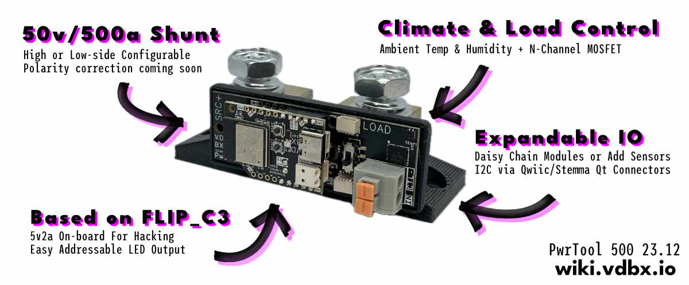

# PwrTool 500

<figure><figcaption>
PwrTool Hardware as of Dec 2023 (Some info out of date)
</figcaption></figure>


We've recently started using this ESPHome component and thank the author for the work they've done.

[https://github.com/latonita/esphome-ina228](https://github.com/latonita/esphome-ina228)



24.04.10 - We've been accepted to do a crowdfunding campaign with Crowd Supply. More details coming soon - expect updated docs as we lock in final details.


## Working Manual

We've started getting hardware into the hands of reviewers and testers. This manual, while incomplete, will get you going.



## Overview

A 500 amp smart shunt for DC power systems up to 60v. It is based on our FLIP-C3 mainboard and power center running ESPHome for seamless integration with Home Assistant out of the box.&#x20;

An on board 45w NPN MOSFET can power fans, LED strips, or control external relays based on automations in Home Assistant. Also keep an eye on the ambient temp/humidity of your control box with the onboard sensor and catch potential issues with the on-die temp sensor of the analog-to-digital converter IC.

PwrTool 500 is fully open, this is your hardware and it is fully hackable. Extend it further with ESPHome, Tasmota or your own custom Arduino or ESP-IDF code. The on-board buck converter provides a total power budget of 10w for all of the activities. Make the PwrTool the brains of your power cabinet.

## Features

* Hot or Cold Side use
  * Selectable by twisting jumper position
  * Polarity and TVS protection
* 6-60VDC - Compatible with any lithium or lead-acid system
  * Bi-directional current sensing up to 500A(300A contstant)
  * INA238 16-bit ADC with on-die temp facing shunt
* SHTC3 Temperature & Humidity Sensor for environmental monitoring
* RGB LED & Red Status LED
* `CTRL-` Connection for external control via NPN MOSFET

## Specifications

* FLIP\_C3 Mainboard
  * BLE 5.0 & Wifi b/g/n
  * 5v2A (10w) buck converter
  * ESP32-C3
    * Internal temp sensor
* GPIO Components
  * Red "Status" LED - GPIO 10
  * WS2812 NeoPixel - GPIO 8
    * Level-shifted output on header as L8
  * User/Boot Switch - GPIO 9
  * Reset Switch - EN Pin
* i2C Bus
  * SCL - GPIO 1
  * SDA - GPIO 0
  * Addresses
    * INA238 - 0x40
      * changeable with on-board DIP switch
    * SHTC3 - 0x70

## Open Hardware

The PwrTool 500 is open source and files are provided under CC4.0-BY-SA

### EasyEDA Pro

Schematic, Board, & BOM are originally created in EasyEDA pro. Also see [FLIP\_C3](../flip_c3/#license-and-files) files.


EasyEDA Pro file


### 3D Models

coming soon

## Open Software

### ESPHome

We are building out a modular set of configuration files for our FLIP\_C3 platform and the products it powers. They are currently available on github here:

[https://github.com/vdbxio/wiki/tree/main/esphome](https://github.com/vdbxio/wiki/tree/main/esphome)&#x20;
