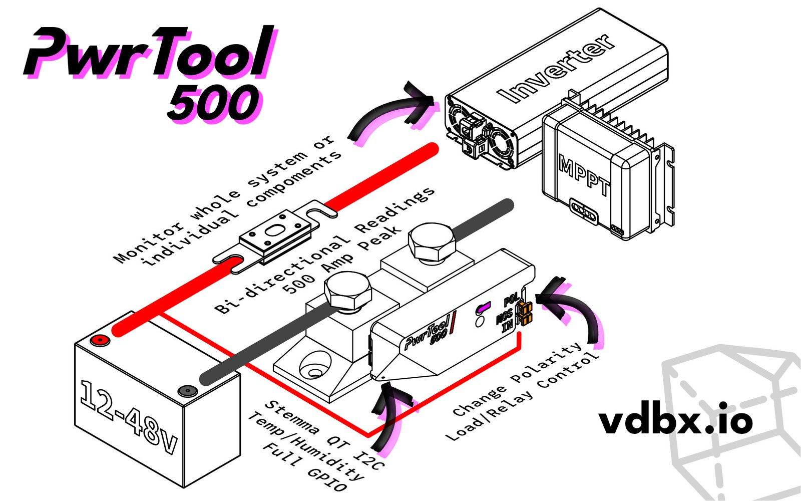

# Installation


This is an extreme work in progress. Please be patient and feel free to ask any questions in our discord.


There are 3 quick steps to get going with the PwrTool 500

1. Wiring
2. Connect to Wi-Fi
3. Adopt in Home Assistant
4. [Adopt into ESPHome ](../flip_c3/esphome.md)`optional`

## Wiring Example

The basic installation of the PwrTool 500 puts it inline with the negative terminal of your battery and it's loads/chargers. Use properly sized cables for the devices you intend to connect.&#x20;

<figure><figcaption></figcaption></figure>

## Hot or Cold // High or Low // Positive or Negative

Most shunts of its type are "low-" or "cold-" side only, meaning the shunt itself is inserted in the ground path of your system. In some circumstances it may be difficult to intercept the ground path in a way that produces accurate results so we've built in an option to switch the PwrTool 500's polarity. The "hot-" or "high-" side mode will allow you to intersect the positive line to your load or battery. &#x20;

**This should be selected before wiring** and is factory set to Cold. Do not use a metal object to remove the jumper.&#x20;

### Delta Readings as a Battery Monitor

In this configuration, current sensing will only be that which flows into and out of the battery. Reading will be the delta between loads and chargers. For example **if charging at 100 watts with a 50 watt load, the reading will be 50 watts charging.** If you want to see the actual charging and load readings you will need to compare it to other data you have in your system, such as a solar charge controller, or use additional PwrTool 500s to separate loads and chargers.
