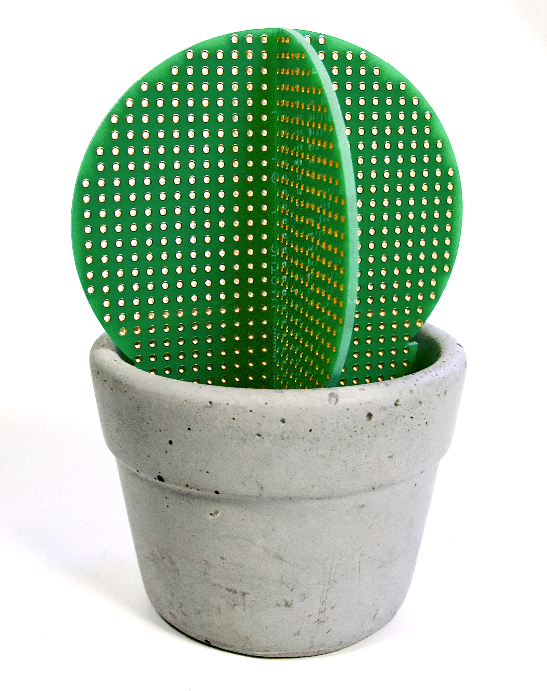

# Hactus

## Hactus


We currently do not have the resources for concrete production, but still have Hactus PCB sets for sale. You can place them in the ground next to your real plants!!!


### Summary

The Hactus is a manufacturable and functional art piece by Chloe Madison (@clomads) that embodies the visual of a cactus succulent using two interlocking PCB 'perfboards.' It also includes a flower pot intended for casting in concrete.

### Source Files

#### PCB Files @ EasyEDA / OSHWLAB

[https://oshwlab.com/clomads/hacker-cactus](https://oshwlab.com/clomads/hacker-cactus)

#### 3D Model in Fusion360&#x20;

For flower pot, mold box

Basis of PCB (not actual board specs) - the throughholes can be a performance killer

[https://a360.co/2oIjCiu](https://a360.co/2oIjCiu)

<figure><figcaption>
The Hactus on a white background.
</figcaption></figure>
