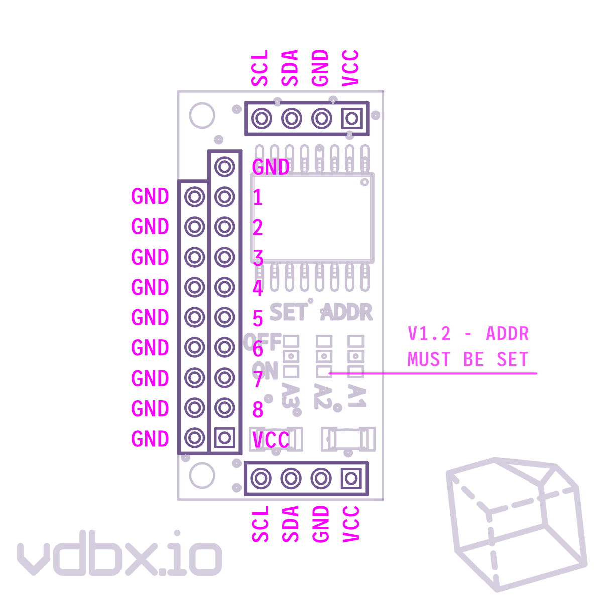

# Specs & Files

All off - Default address `0x20`

## Pinout

<figure><figcaption>
v1.2 Pinout
</figcaption></figure>

## Design Files

This project was designed in EasyEDA Standard and Pro. It is available to fork via oshwlab.com

[https://oshwlab.com/vdbxio/iobyte8/](https://oshwlab.com/vdbxio/iobyte8/)

