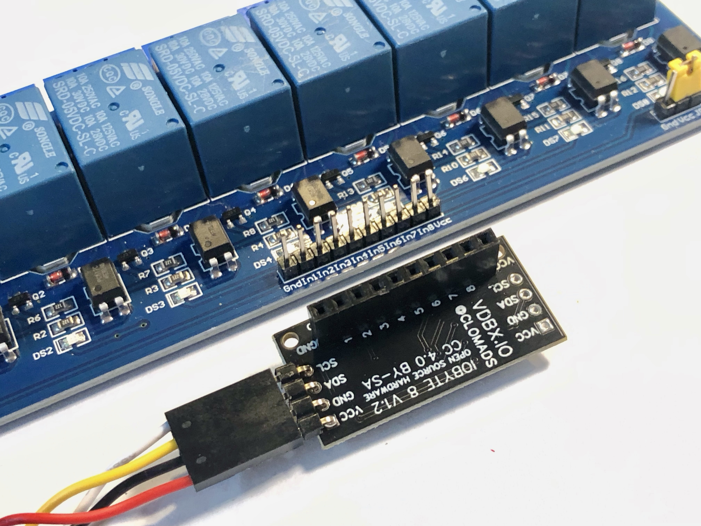

# IOByte

## Summary

The goal of the IOByte is to create a better breakout for the PCF8574 GPIO Extender mostly focused on quickly deploying relays and switch panels via i2c.

The initial idea behind the PCB design was based on having it fit directly on a commonly available 8-Channel relay board, essentially turning it into an all-in-one i2c 8-channel relay board. Existing breakouts generally would require 10 DuPont leads (or other wire interface) to the relay board. Super fast and cheap deployment.

<figure><figcaption></figcaption></figure>

The IOByte can also act as a binary input device. The ground row of pins makes it easy to deploy simple switches connected from and of the 8 open-drain pins to ground. Quickly deploy switch panels with your favorite hardware.

## Changelog

v1.2 - Production run

* Remove VCC Header Row
* Re-Align GND Header Row to allow for a VCC/GND 2P Dupont connection
* Previously known as Pin Saver 8

v1.1 - Attempt to add features for making input hookups easier

* Add GND and VCC header rails parallel to original output header
* Reduce spacing for address jumper footprint
  * [x] ~~TODO: Determine if this is acceptable~~
* Purchased stencil with order to test production runs
  * [x] ~~TODO: Test stencil - remove address jumper openings?~~

v1.0 - Original prototype was designed to fit directly on the headers of a commonly available 8-channel relay board.

* Passthrough i2c headers on opposing sides of the board
* Address jumpers were a bit too widely spaced to solder easily
