# Installation

There are 3 quick steps to get going with the PwrTool 500

1. Wiring
2. Connect to Wi-Fi
3. Adopt in Home Assistant
4. Adopt into ESPHome `optional`

> You can plug in any powered USB-C cable and jump to the WiFi & Home Assistant instructions if you'd like to tinker before wiring up. {.is-info}

## Wiring Options

The PwrTool 500 supports common wiring options for combined or discreet measurements from various sources and loads.

### Delta Mode

In this configuration, current sensing will only be that which flows into and out of the battery. Reading will be the delta between load and charger currents. For example if charging at 10 amps with a 5 amp load, reading will be 5 amps. It will show positive or negative based on the orientation of the shunt.

You'll note that in this example that the load side is connected to battery positive. This ensures that charging produces a positive current where a load will show negative.

<figure><figcaption></figcaption></figure>
