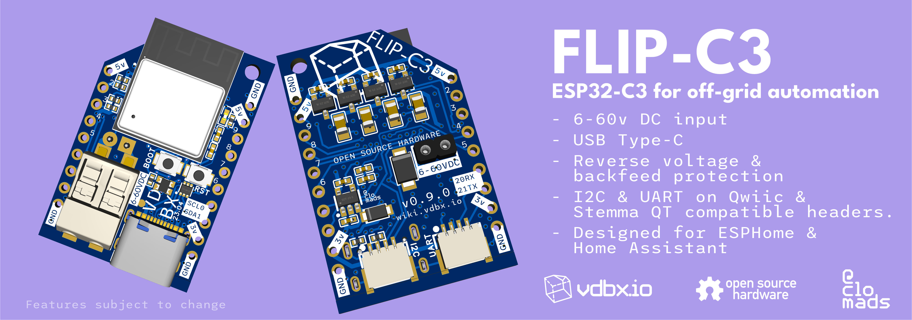

# VDBX/Flip Platform

<figure><figcaption>
Marketing render of the FLIP-C3 as first prototype boards are ordered. 23.04.04
</figcaption></figure>

## Current State

> Last updated: 23.04.25

* First batch of 10 ordered
  * Found that LDO circuitry will not work
* Ordered 10 switching buck PCBs based on LMR16020 IC
  * Ordered as a separate circuit for analysis before integrating into C3 circuitry - the LMR15030 (3a version) might find its way as a backback or an alternate part pick
  * Design should fit in same space as LDO circuitry and not drastically encroach on z-height.
  * Delivered 4/25 to VDBX mailbox in Oakland.

## Design Philosophy

The FLIP platform is a set of standards between circuit designs with the intention of easy install within 12-48v lithium battery systems. It designed as a modular system to create IOT hardware for modern open-source automation systems. The platform will consist of mainboards which have processing and network capabilities and the modules which will provide or interface with switches, lighting, sensors, relays, dimmers, etc.&#x20;

Power conversion modules will be able to be selected based on different needs, but keeping the lineup simple.

~~The mainboards should be able to power themselves and basic modules from the on-board LDO array. More complex or power hungry modules may have their own LDO/switching regulator.~~&#x20;

Early designs incorporated a 60v tolerant LDO array as a potential on board power source, but this didn't work due to thermal constraints of available components.&#x20;

I2C should be considered a high-priority interconnect due to its capability for easy expansion and daisy-chaining. In as many situations as possible, modules should be able to function as either tethered I2C device or with a FLIP mainboard installed. A standalone device (mainboard with module) should be able to connect to it's mainboardless version of itself via the Qwiic & Stemma QT compatible connector. In some cases, smaller boards could stack infinitely, limited only by the available I2C addresses. We've currently coined these smaller boards as _backpacks_.

* Power modules should be tolerant to 60v DC input which covers up to 16s Lifepo4 systems.
* USB-C with 5v LDO regulator as alternate power input allows for alternate power options.
* Standardized 2.54mm dual header layout between boards
  * Passthrough stacking pin/socket headers included
* Stemma QT & Qwiic compatible SH 1.0 connectors
  * I2C & UART
* Home Assistant as target platform
  * ESP32 for Wifi and Ethernet
    * ESPHome Firmware
  * EBYTE Modules for Zigbee (future)
    * PTVO Firmware
  * Thread (Future)

## FLIP-2a

2A buck converter with an input up to 55v&#x20;

Low-profile press-in wire connector

* Reverse polarity protection.
* 24-18AWG Solid
* 22-20AWG Stranded
* 2x2P 2.0mm pass-through header for stacking

## FLIP-C3

The first mainboard for the FLIP platform designed to run ESPHome firmware. It is easily flashable with custom firmware like Tasmota, WLED, etc. but these are not our target and you'll be on your own with those until community interest is&#x20;

* ESP32-C3 designed for ESPHome and Home Assistant.
* USB-C input for power and programming
  * Reverse current protection from DC input via diode
    * Allows for programming in place while protecting both devices.
* LEDs on-board
  * WS2812B RGB - `GPIO8`
  * Purple(?) LED - `GPIO10`
* UART and I2C on Qwicc/Stemma QT compatible headers (SH 1.0-4P)
  * I2C:  `SCL0/SDA1`
  * UART:  `RX20/TX21`
* Boot Button `GPIO9`
* Reset Button `ENABLE`

### ESP32-C3

The ESP32-C3 is considered a market replacement for the ESP8266 while bringing some features from the ESP32. It's a RISC-V platform with Wifi & Bluetooth plus support for Ethernet PHYs including the LAN8720 and W5500, though support for both are limited in ESPHome.

It is likely that the C3 will not be enough as the platform grows and requires more of the processor. Our early planned product line should be more than covered by the capabilities of the C3... the biggest concern being limited to one I2C.

## Future Products

* Switch Panel (Unnamed)
* PwrTool Family
  * Large main system shunt
  * Small Handheld coulometer with XT60, PP45, screw-in, etc. connection options
  * Branch Manager - Smart power distribution panel&#x20;
    * 8x High power p-channel mosfets
  * Lighting Director - PWM Mosfet controller for DC lighting devices.
* Backpacks - should be the same size as the FLIP itself.
  * PWM mosfet 4x via direct connection to GPIO
  * RS485 to TTL for Solar Chargers
  * \~2-3A Switching power supply
    * A few micro buck converter designs are in the works, this could just be an adapter.
  * RGB Addressable Led Driver

## Changelog

* 23.04.18 - LDO circuitry is not going to work, back to the drawing board.&#x20;
  * Will start with an existing available switching supply that works up to 55v to launch Flip//Shift & PwrTool 500 - make backpack board and test its capabilities.
  * Remove LDO circuitry from FLIP-C3 and reconsider footprint size.

